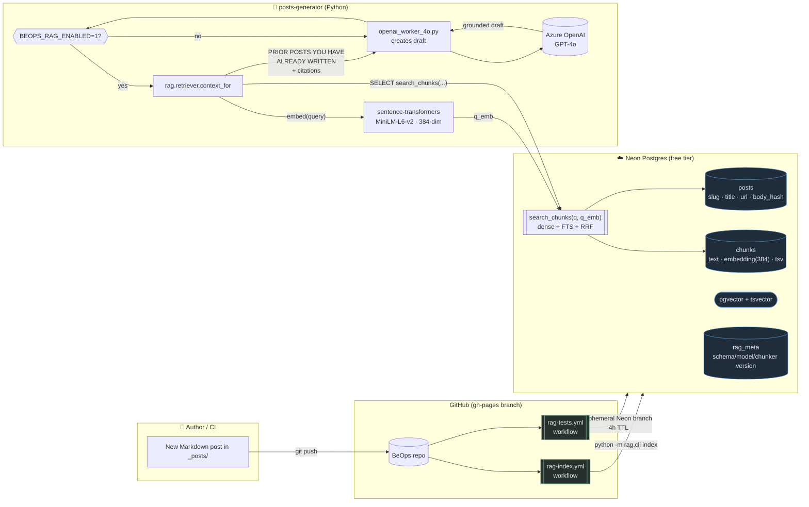
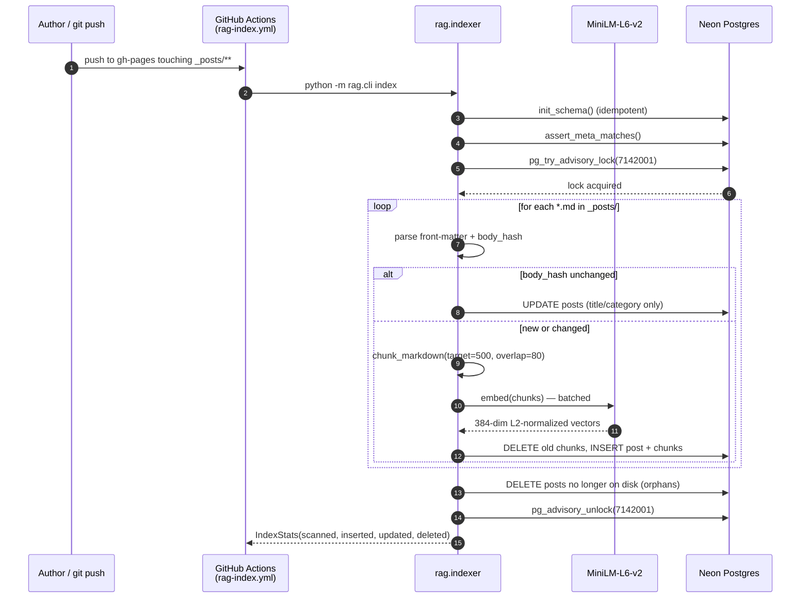
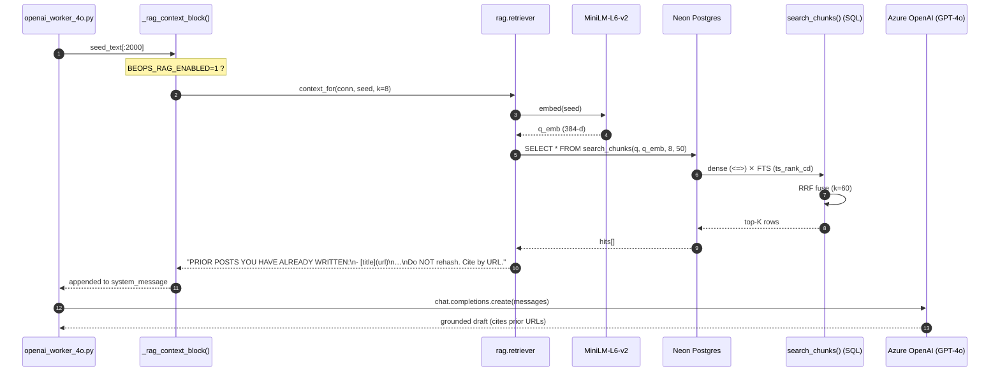
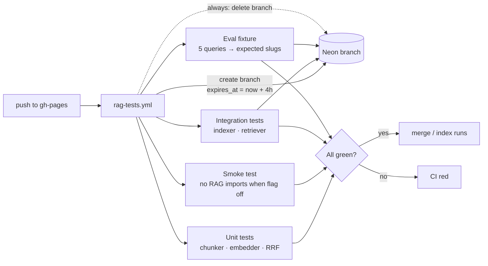

# BeOps RAG Architecture

How the **RAG-over-own-posts** pipeline is built and how it plugs into the
existing AI content generator.

The goal: when the generator drafts a new post, it first asks Postgres
*"what have I already written that touches this topic?"*, then receives a
short block of citations + an anti-rehash instruction inside its system
prompt. Cost target: **$0/month**.

---

## 1. System overview



**Key properties**

| Concern | Choice | Why |
|---|---|---|
| Vector store | Neon pgvector (free, scale-to-zero) | $0 idle, no infra to babysit |
| Embeddings | `sentence-transformers/all-MiniLM-L6-v2` (384-dim, MIT, CPU) | runs in GH Actions, no API key, no quota |
| Lexical | Postgres `tsvector` + `ts_rank_cd` | comes with the database |
| Fusion | Reciprocal Rank Fusion (k=60) **in SQL** | dense + lexical hits combined inside one CTE — Python just calls one function |
| ANN index | **none at v1** (exact cosine scan) | tiny corpus (~65 chunks); IVFFlat hurts recall here |
| Drift guard | `rag_meta` table pins `(schema_version, embedding_model, chunker_version)` | indexer aborts with a clear error if any of these change |
| Concurrency | Postgres advisory lock `7142001` + GH Actions concurrency groups | safe under parallel pushes |
| Feature flag | `BEOPS_RAG_ENABLED` (default OFF) | smoke test asserts `torch`/`psycopg` are **not** imported when off |

---

## 2. Indexing flow

What happens on every push to `gh-pages` that touches `_posts/**`:



Idempotency comes from `body_hash` (sha256 of post-frontmatter body) —
metadata-only edits update title/url cheaply; identical content is a no-op.

---

## 3. Retrieval flow (generation time)

What happens when `posts-generator` drafts a new post with the flag on:



All ranking — dense cosine, BM25-style FTS, and RRF — happens inside one
SQL CTE in `search_chunks()`. Python is a thin client; if you change the
fusion strategy, you change one SQL function.

---

## 4. Quality gate

`rag-tests.yml` runs on every push and spins up a real Neon branch with
a 4-hour TTL so cancelled jobs can't leak past the 10-branch cap:



The eval fixture (`posts-generator/tests/fixtures/eval_queries.yaml`) is
the regression gate: hand-picked queries each declare the expected slug
in the top-K. If a future change breaks retrieval for "kubernetes
readiness probe configuration" → `2024-12-15-kubernetes`, CI goes red.

---

## 5. File map

```
posts-generator/
├── rag/
│   ├── __init__.py        # pins schema/chunker/model versions + EMBEDDING_DIM=384
│   ├── schema.sql         # posts, chunks, rag_meta + search_chunks() SQL fn
│   ├── db.py              # connect, init_schema, meta-check, advisory lock
│   ├── chunker.py         # front-matter strip, H2-bounded chunks w/ overlap
│   ├── embedder.py        # sentence-transformers wrapper (L2-normalized)
│   ├── indexer.py         # idempotent + incremental + orphan reconciliation
│   ├── retriever.py       # search() and context_for() (prompt block builder)
│   └── cli.py             # python -m rag.cli {init,index,reset,search}
├── tests/
│   ├── conftest.py        # Neon ephemeral branch fixture (4h TTL)
│   ├── fixtures/eval_queries.yaml
│   └── test_*.py          # unit · smoke · integration · eval
├── requirements-rag.txt
├── pytest.ini
└── openai_worker_4o.py    # _rag_context_block() — opt-in via BEOPS_RAG_ENABLED

.github/workflows/
├── rag-index.yml          # incremental indexer on _posts/** pushes
└── rag-tests.yml          # full pytest on ephemeral Neon branch
```

---

## 6. Operate it

```bash
# turn it on locally
export BEOPS_RAG_ENABLED=1
export NEON_DATABASE_URL='postgres://…'   # same as the GH secret

cd posts-generator

# see what's indexed
python -m rag.cli search "kubernetes probes"

# force a full reindex (e.g. after bumping CHUNKER_VERSION)
python -m rag.cli reset
python -m rag.cli index

# run the tests against your own ephemeral Neon branch
export NEON_API_KEY='napi_…' NEON_PROJECT_ID='…'
pytest -v
```
